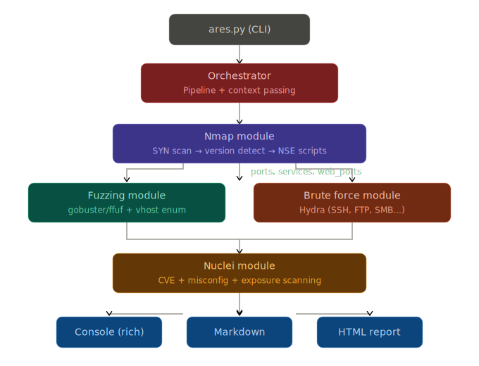

<div align="center">
    
    <h1>Advanced Reconnaissance & Enumeration Scanner</h1>
</div>

## Features

- **Nmap Module** — Quick SYN scan → full port discovery → deep version/script scan + optional UDP
- **Fuzzing Module** — Directory brute-forcing + VHost enumeration (auto-detects gobuster/ffuf/feroxbuster)
- **Brute Force Module** — Hydra-based credential attacks on detected services (SSH, FTP, SMB, RDP, MySQL...)
- **Nuclei Module** — Automated vulnerability scanning with severity filtering
- **Smart pipeline** — Each module passes context to the next (nmap → fuzzing/brute targets)
- **Triple reporting** — Rich console output + Markdown + HTML dark-themed report
- **Organized workspace** — Auto-creates folder structure per target



## Installation

### Automatic (recommended)

```bash
git clone https://github.com/JavierOlmedo/ARES.git
cd ARES
bash install.sh
```

`install.sh` checks Python 3.10+, installs Python deps, and verifies (or installs via `apt`) all required system tools and wordlists.

### Manual

```bash
pip install -r requirements.txt
```

System tools required: `nmap`, `gobuster`/`ffuf`/`feroxbuster`, `hydra`, `nuclei`
Wordlists required: `seclists`, `rockyou.txt`
Root privileges recommended (SYN scan)

### Verify your setup

```bash
python3 ares.py --check
```

## Quick Start

```bash
# Basic scan (all modules)
sudo python3 ares.py -t 10.10.11.100 -H target.htb

# Quick scan — nmap + fuzzing only
sudo python3 ares.py -t 10.10.11.100 -H target.htb -m nmap,fuzzing

# Aggressive — full port range + UDP
sudo python3 ares.py -t 10.10.11.100 -H target.htb --aggressive --udp

# Skip brute-force and nuclei
sudo python3 ares.py -t 10.10.11.100 --no-brute --no-nuclei

# Custom wordlists and threads
sudo python3 ares.py -t 10.10.11.100 -H target.htb \
    --wordlist-web /usr/share/seclists/Discovery/Web-Content/big.txt \
    --threads 20
```

## Output Structure

```
ares_target_htb/
├── nmap/
│   ├── quick_tcp.{nmap,xml,gnmap}
│   ├── detailed.{nmap,xml,gnmap}
│   └── udp.{nmap,xml,gnmap}
├── fuzzing/
│   ├── dirs_80.txt
│   └── vhosts_80.txt
├── bruteforce/
│   └── hydra_ssh_22.txt
├── nuclei/
│   └── nuclei_http_target_htb.json
├── reports/
│   ├── ares_report.md
│   └── ares_report.html
├── loot/
│   └── credentials.txt
├── exploits/
├── ares_config.json
└── ares_results.json
```

## Modules

| Module      | Phase | Tools Used               | Description                        |
|-------------|-------|--------------------------|------------------------------------|
| `nmap`      | 0     | nmap                     | Port scan + service enumeration    |
| `fuzzing`   | 1     | gobuster / ffuf / ferox  | Directory + VHost brute-forcing    |
| `bruteforce`| 2     | hydra                    | Credential attacks                 |
| `nuclei`    | 2     | nuclei                   | CVE + misconfig scanning           |

## Adding Custom Modules

Create a new file in `modules/` inheriting from `BaseModule`:

```python
from modules.base import BaseModule
from core import logger

class MyModule(BaseModule):
    name = "mymodule"
    description = "Does something cool"
    required_tools = ["sometool"]
    phase = 1

    def run(self, context: dict) -> dict:
        # Access previous results: context["nmap"]["ports"]
        logger.info("Running my custom scan...")
        return {"findings": [...]}
```

Register it in `modules/__init__.py`:
```python
from modules.mymodule import MyModule
MODULE_REGISTRY["mymodule"] = MyModule
```

## CLI Reference

| Flag                  | Description                                |
|-----------------------|--------------------------------------------|
| `-t, --target`        | Target IP (required)                       |
| `-H, --hostname`      | Target hostname                            |
| `-o, --output`        | Custom output directory                    |
| `--quiet`             | Minimal scan (top 1000 ports, no extras)   |
| `--aggressive`        | Full port range, higher rate limits        |
| `-m, --modules`       | Comma-separated module list                |
| `--no-brute`          | Skip brute-force                           |
| `--no-nuclei`         | Skip nuclei                                |
| `--no-fuzz`           | Skip fuzzing                               |
| `--udp`               | Enable UDP scan                            |
| `--threads`           | Thread count (default: 10)                 |
| `--top-ports`         | Nmap top ports (default: 1000)             |
| `--extensions`        | Fuzz extensions (default: php,html,txt...) |
| `--report`            | Report formats (console,markdown,html)     |
| `--check`             | Verify dependencies and exit               |

## License

MIT — Use responsibly. For authorized testing only.

Made with ❤️ in Spain